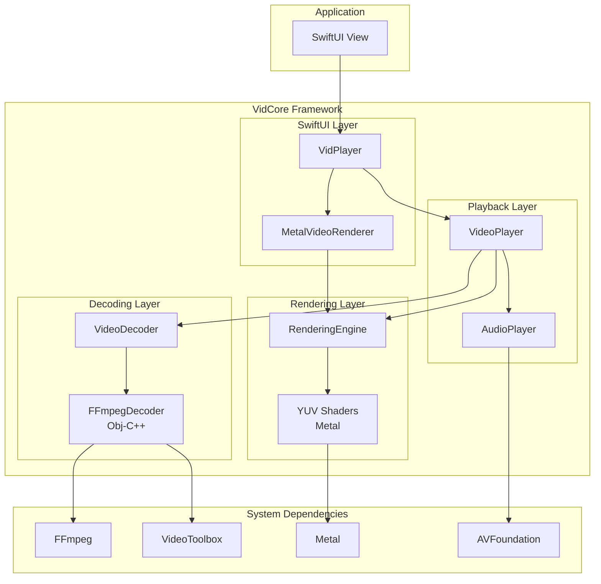

# VidCore

A video decoding and rendering framework for macOS built on FFmpeg and Metal.

## Overview

VidCore provides high-performance video playback capabilities for macOS applications. It handles container formats (MKV, WebM, AVI, MP4), hardware-accelerated decoding via VideoToolbox, and GPU-accelerated rendering via Metal.

## Features

- **FFmpeg + dav1d Decoding**: Support for diverse codecs (H.264, H.265/HEVC, VP8, VP9, AV1 via dav1d, etc.)
- **Hardware Acceleration**: Automatic VideoToolbox acceleration when available
- **HDR Support**: Full HDR10 support with BT.2020 color primaries, PQ (SMPTE ST 2084) transfer function, and 10-bit color depth
- **Metal Rendering**: Zero-copy GPU YUV→RGB conversion with custom Metal shaders for both SDR and HDR content
- **Audio Playback**: Synchronized audio via AVAudioEngine with A/V sync correction
- **SwiftUI Integration**: Drop-in `VidPlayer` view, similar to AVKit's `VideoPlayer`
- **Async/Await API**: Modern Swift concurrency with parallel demux/decode pipelines
- **Optimized Buffering**: Intelligent buffer management with CVPixelBufferPool and frame reordering for multi-threaded decoders

## Requirements

- macOS 15.0+
- Xcode 15.0+

## Installation

### Embedding VidCore.framework

VidCore includes bundled FFmpeg + dav1d libraries—no external dependencies required.

1. **Build VidCore** (if not pre-built):
   ```bash
   cd /path/to/VidPreview
   xcodebuild -scheme VidCore -configuration Release build
   ```

2. **Embed in your project**:
   - Drag `VidCore.framework` into your app target
   - In **General > Frameworks, Libraries, and Embedded Content**, set to "Embed & Sign"

3. **Import and use**:
   ```swift
   import VidCore
   ```

### Building FFmpeg + dav1d (One-Time)

If the bundled libraries are missing, build them:

```bash
# Install build tools (one-time)
brew install nasm meson ninja pkg-config

# Build FFmpeg + dav1d (~5-10 min)
cd VidCore/Scripts
chmod +x build-ffmpeg.sh
./build-ffmpeg.sh
```

This creates universal static libraries (arm64 + x86_64) in `VidCore/Frameworks/FFmpeg/`:
- `libavcodec.a`, `libavformat.a`, `libavutil.a`, `libswresample.a`, `libswscale.a`
- `libdav1d.a` (fast AV1 decoder)

---

## Quick Start

### Simplest Usage

```swift
import SwiftUI
import VidCore

struct ContentView: View {
    var body: some View {
        VidPlayerURL(url: videoURL)  // Loads and plays automatically
    }
}
```

### With Player Control

```swift
struct PlayerView: View {
    @State private var player = VideoPlayer()
    
    var body: some View {
        VidPlayer(player: player)
            .task {
                try? await player.load(url: videoURL)
                player.play()
            }
    }
}
```

---

## Usage Guide

### SwiftUI Integration

VidCore provides two SwiftUI views for easy integration:

#### VidPlayerURL (Self-Contained)

For simple playback with no external control needed:

```swift
VidPlayerURL(url: videoURL)                    // Auto-plays
VidPlayerURL(url: videoURL, autoPlay: false)   // Load only, manual play
```

#### VidPlayer (Controlled)

For full control over playback:

```swift
@State private var player = VideoPlayer()

VidPlayer(player: player)
    .task {
        try? await player.load(url: videoURL)
        player.play()
    }
```

#### Custom Overlays

Add custom controls on top of the video (like AVKit's `VideoPlayer`):

```swift
VidPlayer(player: player) {
    VStack {
        Spacer()
        CustomControlsBar(player: player)
    }
}
```

#### Disabling Built-in UI

When providing a complete custom UI, disable the built-in loading/error/finished states:

```swift
VidPlayer(player: player, showsBuiltInControls: false) {
    MyFullCustomUI(player: player)
}
```

---

### VideoPlayer API

The `VideoPlayer` class is the core playback controller:

```swift
let player = VideoPlayer()

// Load
try await player.load(url: videoURL)

// Playback control
player.play()
player.pause()
player.togglePlayPause()

// Seeking
await player.seek(to: 30.0, accurate: true)   // Seek to 30s, frame-accurate
await player.seek(to: 30.0, accurate: false)  // Seek to nearest keyframe (faster)

// Volume
player.volume = 0.5        // 0.0 to 1.0
player.isMuted = true
player.toggleMute()

// State observation (works with SwiftUI @Observable)
player.state              // .idle, .loading, .ready, .playing, .paused, .seeking, .finished, .error
player.currentTime        // Current playback position in seconds
player.duration           // Total duration in seconds
player.isPlaying          // Convenience for state == .playing

// Metadata
player.videoInfo?.width
player.videoInfo?.height
player.videoInfo?.frameRate
player.videoInfo?.codecName
player.videoInfo?.isHardwareAccelerated
player.hasAudio

// Cleanup
await player.close()
```

---

### Low-Level API (Advanced)

#### MetalVideoRenderer

For custom rendering pipelines where you need direct control:

```swift
if let renderingEngine = player.renderingEngine {
    MetalVideoRenderer(
        renderingEngine: renderingEngine,
        currentFrame: Binding(get: { player.currentFrame }, set: { _ in })
    )
    .aspectRatio(
        CGSize(width: player.videoInfo?.width ?? 16, height: player.videoInfo?.height ?? 9),
        contentMode: .fit
    )
}
```

#### VideoDecoder

For building custom decode pipelines with parallel demux/decode:

```swift
let decoder = try VideoDecoder(url: videoURL)

// Access metadata
print("Resolution: \(decoder.videoInfo.width)x\(decoder.videoInfo.height)")
print("Duration: \(decoder.videoInfo.duration)s")
print("Hardware accelerated: \(decoder.videoInfo.isHardwareAccelerated)")

// Demux and decode loop
while let packet = await decoder.demuxNextPacket() {
    let frames = await decoder.decodePacket(packet)
    
    for frame in frames {
        switch frame {
        case .video(let videoFrame):
            // videoFrame.pixelBuffer contains the CVPixelBuffer
            // videoFrame.presentationTime is the PTS in seconds
        case .audio(let pcmBuffer, let pts):
            // pcmBuffer is an AVAudioPCMBuffer
        }
    }
}

// End of stream - flush decoder for remaining frames
await decoder.flushVideoDecoder()
while let frame = await decoder.drainVideoFrame() {
    // Process remaining buffered frames
}

decoder.close()
```

#### Extracting Cover Images

MKV and other containers can include embedded cover art (common for movies/anime):

```swift
let decoder = try VideoDecoder(url: videoURL)

if let coverData = decoder.extractCoverImage() {
    // coverData is JPEG, PNG, or BMP image data
    let image = NSImage(data: coverData)
}

decoder.close()
```

#### Generating Thumbnails

Use the decoder and rendering engine together to generate video thumbnails:

```swift
let decoder = try VideoDecoder(url: videoURL)
let renderingEngine = RenderingEngine()

// Seek to 10% into the video for a representative frame
let seekTime = decoder.videoInfo.duration * 0.1
try await decoder.seek(to: seekTime, accurate: true)

// Decode one frame
if let packet = await decoder.demuxNextPacket() {
    let frames = await decoder.decodePacket(packet)
    
    for frame in frames {
        if case .video(let videoFrame) = frame {
            // Render to CGImage with optional scaling
            let thumbnailSize = CGSize(width: 320, height: 180)
            if let cgImage = renderingEngine?.renderToCGImage(videoFrame, targetSize: thumbnailSize) {
                let nsImage = NSImage(cgImage: cgImage, size: thumbnailSize)
                // Use the thumbnail...
            }
            break
        }
    }
}

decoder.close()
```

---

### HDR Playback

VidCore provides full HDR10 support with automatic detection and rendering:

#### Automatic HDR Detection

```swift
let decoder = try VideoDecoder(url: videoURL)

if decoder.videoInfo.isHDR {
    print("HDR Content Detected!")
    print("Color Primaries: \(decoder.videoInfo.colorPrimaries)")  // 9 = BT.2020
    print("Transfer Function: \(decoder.videoInfo.colorTransfer)")  // 16 = PQ
    print("Bit Depth: \(decoder.videoInfo.bitsPerComponent)")      // 10-bit
}
```

#### HDR Rendering Requirements

For proper HDR display, configure your Metal layer for EDR:

```swift
import SwiftUI
import MetalKit

// In your MetalKit view setup:
metalLayer.pixelFormat = .rgba16Float  // Required for EDR
metalLayer.wantsExtendedDynamicRangeContent = true

// VidCore will automatically:
// 1. Detect the rgba16Float format
// 2. Use PQ→Linear conversion shaders
// 3. Output values where 1.0 = 100 nits (SDR white)
// 4. Values > 1.0 represent HDR highlights
```

#### HDR Metadata

Access detailed color information from the decoder:

```swift
// Color primaries (AVCOL_PRI_*)
// 1 = BT.709 (SDR), 9 = BT.2020 (HDR)

// Transfer function (AVCOL_TRC_*)
// 1 = BT.709 (SDR)
// 16 = SMPTE ST 2084 / PQ (HDR10)
// 18 = ARIB STD-B67 (HLG)

// Color space (AVCOL_SPC_*)
// 1 = BT.709, 9 = BT.2020 non-constant luminance

// Color range (AVCOL_RANGE_*)
// 1 = Video/Limited (16-235)
// 2 = Full (0-255)
```

#### Supported HDR Formats

- **Pixel Formats**: P010 (10-bit bi-planar), YUV420P10LE (10-bit tri-planar)
- **Color Primaries**: BT.2020 (wide color gamut)
- **Transfer Function**: PQ/SMPTE ST 2084 (HDR10)
- **Bit Depth**: 10-bit color depth
- **Output**: Linear light values for EDR displays

---

## API Reference

### VideoPlayer

High-level playback orchestrator with A/V sync and state management.

| Property/Method | Description |
|-----------------|-------------|
| `init(frameBufferSize:packetQueueSize:)` | Create player with custom buffer sizes |
| `load(url:)` | Load a video file (async, throws) |
| `play()` | Start or resume playback |
| `pause()` | Pause playback |
| `togglePlayPause()` | Toggle between play and pause |
| `seek(to:accurate:)` | Seek to timestamp (async) |
| `close()` | Release all resources (async) |
| `state` | Current `PlaybackState` |
| `currentTime` | Current position in seconds |
| `duration` | Total duration in seconds |
| `isPlaying` | Whether currently playing |
| `volume` | Playback volume (0.0–1.0) |
| `isMuted` | Whether muted |
| `videoInfo` | Video metadata |
| `currentFrame` | Current `VideoFrame` for rendering |
| `renderingEngine` | Metal rendering context |
| `hasAudio` | Whether video has audio track |

### PlaybackState

```swift
enum PlaybackState {
    case idle       // Initial state, no video loaded
    case loading    // Video is being loaded
    case ready      // Loaded, ready to play
    case playing    // Currently playing
    case paused     // Paused
    case seeking    // Seek in progress
    case finished   // Playback completed
    case error(VideoPlayerError)
}
```

### VidPlayer

SwiftUI view for displaying video with optional overlay.

```swift
// Basic
VidPlayer(player: VideoPlayer)

// With overlay
VidPlayer(player: VideoPlayer) { OverlayView() }

// With options
VidPlayer(player: VideoPlayer, showsBuiltInControls: Bool, overlay: () -> Overlay)
```

**Parameters:**
- `player`: The `VideoPlayer` instance to display
- `showsBuiltInControls`: Show built-in loading/error/finished UI (default: `true`)
- `overlay`: Custom content to display over the video

### VidPlayerURL

Self-contained SwiftUI view for simple playback.

```swift
VidPlayerURL(url: URL, autoPlay: Bool = true)
```

### VideoDecoder

Low-level decoder with split demux/decode pipeline.

| Method | Description |
|--------|-------------|
| `init(url:)` | Initialize decoder (throws) |
| `demuxNextPacket()` | Get next packet from container (async) |
| `decodePacket(_:)` | Decode packet to frames (async) |
| `seek(to:accurate:)` | Seek to timestamp (async, throws) |
| `flushVideoDecoder()` | Signal end of stream (async) |
| `drainVideoFrame()` | Get remaining buffered frames (async) |
| `extractCoverImage()` | Extract embedded cover art (JPEG/PNG) from container |
| `close()` | Release resources |
| `videoInfo` | Video metadata |

### VideoInfo

Video stream metadata with color information and HDR detection.

| Property | Type | Description |
|----------|------|-------------|
| `width` | `Int` | Width in pixels |
| `height` | `Int` | Height in pixels |
| `frameRate` | `Double` | Frame rate (fps) |
| `duration` | `Double` | Duration in seconds |
| `codecName` | `String` | Codec identifier (e.g., "h264") |
| `isHardwareAccelerated` | `Bool` | Using VideoToolbox |
| `isHDR` | `Bool` | Whether content is HDR (PQ or HLG) |
| `colorPrimaries` | `Int` | Color primaries (1=BT.709, 9=BT.2020) |
| `colorTransfer` | `Int` | Transfer function (1=BT.709, 16=PQ, 18=HLG) |
| `colorSpace` | `Int` | YUV color matrix (1=BT.709, 9=BT.2020nc) |
| `colorRange` | `Int` | Video range (1=limited/16-235, 2=full/0-255) |
| `bitsPerComponent` | `Int` | Bit depth (8, 10, or 12 bits) |

### VideoFrame

A decoded video frame with pixel data and timing information.

| Property | Type | Description |
|----------|------|-------------|
| `pixelBuffer` | `CVPixelBuffer` | Raw pixel data (NV12, I420, P010, or BGRA) |
| `presentationTime` | `Double` | PTS in seconds |
| `isHDR` | `Bool` | Whether frame contains HDR content |
| `width` | `Int` | Frame width |
| `height` | `Int` | Frame height |

**Supported Pixel Formats:**
- **NV12** (`kCVPixelFormatType_420YpCbCr8BiPlanarVideoRange`) - 8-bit bi-planar, hardware decode
- **I420** (`kCVPixelFormatType_420YpCbCr8Planar`) - 8-bit tri-planar, software decode
- **P010** (`kCVPixelFormatType_420YpCbCr10BiPlanarVideoRange`) - 10-bit bi-planar, HDR hardware decode
- **BGRA** (`kCVPixelFormatType_32BGRA`) - 8-bit packed, fallback format

### RenderingEngine

GPU-accelerated frame rendering with HDR support.

| Method | Description |
|--------|-------------|
| `init?()` | Initialize Metal context |
| `renderVideoFrame(_:to:)` | Render VideoFrame with HDR awareness |
| `renderPixelBuffer(_:to:)` | Render CVPixelBuffer to drawable (SDR) |
| `renderHDRPixelBuffer(_:to:)` | Render 10-bit HDR content with PQ EOTF |
| `renderToCGImage(_:targetSize:)` | Render VideoFrame to CGImage for thumbnail generation |
| `flush()` | Flush texture cache |

**HDR Rendering:**
- Automatically detects drawable format (bgra8Unorm vs rgba16Float)
- For HDR content on EDR-capable layers, uses PQ→Linear conversion
- Supports both P010 (bi-planar) and YUV420P10LE (tri-planar) 10-bit formats
- Falls back to SDR rendering if layer doesn't support EDR
- Full-range and video-range YUV variants for proper color levels

**Shader Pipelines:**
- **SDR NV12/I420**: Video-range and full-range BT.709 YUV→RGB
- **HDR NV12/I420**: 10-bit BT.2020 YUV→Linear with PQ EOTF
- **Float16 Output**: For EDR displays (rgba16Float, 1.0 = 100 nits)

---

## Performance Optimizations

VidCore includes several performance optimizations for efficient video playback:

### GPU YUV Conversion
- **Zero-copy rendering** via Metal texture cache, eliminating CPU overhead
- **Direct GPU conversion** from YUV to RGB, avoiding FFmpeg's `sws_scale`
- **Performance gain**: Eliminates 20-30ms per frame CPU overhead for 4K video
- Supports YUV 4:2:0 subsampling with proper half-resolution U/V sampling

### CVPixelBufferPool Management
- **Reusable buffer pools** for both SDR (I420) and HDR (P010) frames
- **Lazy initialization** of HDR pool (only created when first 10-bit frame detected)
- **Reduces memory fragmentation** for high-resolution playback
- **Automatic pool recreation** on resolution changes
- **Periodic flushing** every 60 frames to reduce transient texture memory

### 10-bit to P010 Conversion
- **Optimized bit-shift conversion** from YUV420P10LE to P010 format
- **Unrolled loops** for Y plane processing (4-pixel chunks)
- **Row-wise processing** for cache efficiency
- **Efficient UV interleaving** with proper stride handling

### Frame Reordering
- **Automatic PTS-based sorting** for multi-threaded decoders
- Handles out-of-order frames from dav1d, libvpx, and other parallel decoders
- **Binary insertion** for efficient sorted buffer maintenance
- **1-frame reorder delay** to allow out-of-order arrivals

### Optimized Seeking
- **Two-phase seek**: Fast keyframe seek + frame-accurate catchup
- **AVDISCARD_NONREF** optimization to skip non-reference frames during catchup
- **Safety margin** (0.5s) before target to enable decoders to gather reference frames
- Configurable via `seekOptimizationEnabled` property

---

## Architecture



---

## License

MIT License
