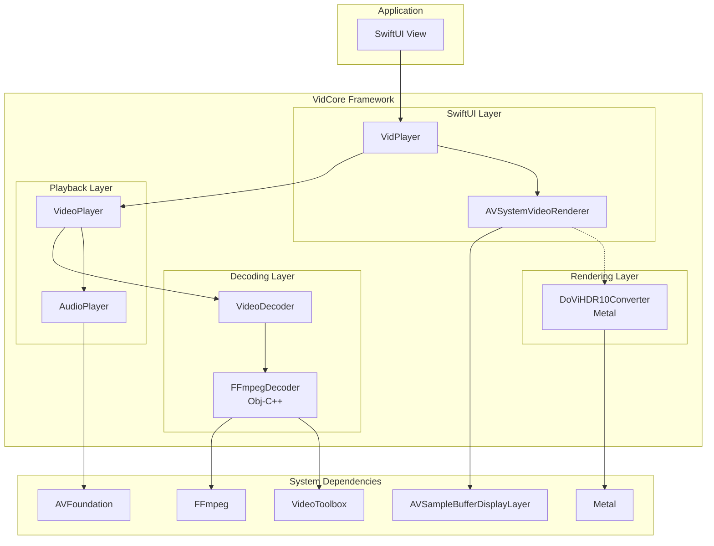

# VidCore

A video decoding and rendering framework for macOS built on FFmpeg and Metal.

## Overview

VidCore provides high-performance video playback capabilities for macOS applications. It handles container formats (MKV, WebM, AVI, MP4), hardware-accelerated decoding via VideoToolbox, and system-integrated rendering via `AVSampleBufferDisplayLayer` with custom Metal fallback for Dolby Vision.

## Features

- **FFmpeg Decoding**: Support for diverse codecs (H.264, H.265/HEVC, VP8, VP9, AV1 via dav1d, etc.)
- **Hardware Acceleration**: Automatic VideoToolbox acceleration when available
- **System-Integrated Rendering**: Uses `AVSampleBufferDisplayLayer` for power-efficient, color-perfect rendering of SDR, and HDR content
- **Dolby Vision Support**: Custom Metal pipeline for Profile 5 (IPTPQc2) frames, converting them to HDR10 in real-time for system display
- **HDR Support**: Full HDR10 and HLG support with BT.2020 color primaries and proper EDR signaling
- **Tone Mapping**: Automatic system-level tone mapping using L1 scene brightness metadata extracted from Dolby Vision streams
- **Audio Playback**: Synchronized audio via AVAudioEngine with A/V sync correction
- **SwiftUI Integration**: Drop-in `VidPlayer` view with optional debug overlay, similar to AVKit's `VideoPlayer`
- **Async/Await API**: Modern Swift concurrency with parallel demux/decode pipelines
- **Optimized Buffering**: Intelligent buffer management with CVPixelBufferPool and frame reordering for multi-threaded decoders
- **Optimized Seeking**: Zero-latency scrub interaction with two-phase seek (instant jump + precise refinement)

## Requirements

- macOS 15.0+
- Xcode 15.0+

## Installation

### Embedding VidCore.framework

VidCore includes bundled FFmpeg + dav1d libraries—no external dependencies required.

1. **Build VidCore** (if not pre-built):
   ```bash
   cd /path/to/VidPreview
   xcodebuild -scheme VidCore -configuration Release build
   ```

2. **Embed in your project**:
   - Drag `VidCore.framework` into your app target
   - In **General > Frameworks, Libraries, and Embedded Content**, set to "Embed & Sign"

3. **Import and use**:
   ```swift
   import VidCore
   ```

### Building FFmpeg + dav1d (One-Time)

If the bundled libraries are missing, build them:

```bash
# Install build tools (one-time)
brew install nasm meson ninja pkg-config

# Build FFmpeg + dav1d (~5-10 min)
cd VidCore/Scripts
chmod +x build-ffmpeg.sh
./build-ffmpeg.sh
```

This creates universal static libraries (arm64 + x86_64) in `VidCore/Frameworks/FFmpeg/`:
- `libavcodec.a`, `libavformat.a`, `libavutil.a`, `libswresample.a`, `libswscale.a`
- `libdav1d.a` (fast AV1 decoder)

---

## Quick Start

### Basic Playback
The simplest way to play a video is using the `VidPlayer` view with a URL. This handles loading, playback, and error states automatically.

```swift
import SwiftUI
import VidCore

struct ContentView: View {
    let videoURL: URL
    
    var body: some View {
        // Auto-play with debug overlay enabled
        VidPlayer(url: videoURL, allowsDebugMenu: true)
            .edgesIgnoringSafeArea(.all)
    }
}
```

### Advanced Control
For fine-grained control (play/pause, seek, metadata), create a `VideoPlayer` instance.

```swift
import SwiftUI
import VidCore

struct PlayerView: View {
    let videoURL: URL
    @State private var player = VideoPlayer()
    
    var body: some View {
        VStack {
            VidPlayer(player: player)
                .task {
                    // Load and play
                    try? await player.load(url: videoURL)
                    player.play()
                }
            
            // Custom controls
            HStack {
                Button(player.isPlaying ? "Pause" : "Play") {
                    player.togglePlayPause()
                }
                
                if let info = player.videoInfo, info.isHDR {
                    Text("HDR: \(info.transferFunctionName)")
                        .foregroundStyle(.green)
                }
            }
            .padding()
        }
    }
}
```

---

## Usage Guide

### SwiftUI Integration

VidCore provides `VidPlayer` for SwiftUI integration with multiple initialization options:

#### VidPlayer with URL (Self-Contained)

For simple playback where the player manages its own lifecycle:

```swift
VidPlayer(url: videoURL)                              // Auto-plays
VidPlayer(url: videoURL, autoPlay: false)             // Load only, manual play
VidPlayer(url: videoURL, allowsDebugMenu: true)       // With debug overlay
```

#### VidPlayer (Controlled)

For full control over playback:

```swift
@State private var player = VideoPlayer()

VidPlayer(player: player)
    .task {
        try? await player.load(url: videoURL)
        player.play()
    }
```

#### Custom Overlays

Add custom controls on top of the video (like AVKit's `VideoPlayer`):

```swift
VidPlayer(player: player) {
    VStack {
        Spacer()
        CustomControlsBar(player: player)
    }
}
```

#### Disabling Built-in UI

When providing a complete custom UI, disable the built-in loading/error/finished states:

```swift
VidPlayer(player: player, showsBuiltInControls: false) {
    MyFullCustomUI(player: player)
}
```

---

### VideoPlayer API

The `VideoPlayer` class is the core playback controller:

```swift
let player = VideoPlayer()

// Load
try await player.load(url: videoURL)

// Playback control
player.play()
player.pause()
player.togglePlayPause()

// Seeking
await player.seek(to: 30.0, accurate: true)   // Seek to 30s, frame-accurate
await player.seek(to: 30.0, accurate: false)  // Seek to nearest keyframe (faster)

// Volume
player.volume = 0.5        // 0.0 to 1.0
player.isMuted = true
player.toggleMute()

// State observation (works with SwiftUI @Observable)
player.state              // .idle, .loading, .ready, .playing, .paused, .seeking, .finished, .error
player.currentTime        // Current playback position in seconds
player.duration           // Total duration in seconds
player.isPlaying          // Convenience for state == .playing

// Metadata
if let info = player.videoInfo {
    // Basic
    print("\(info.width)x\(info.height) @ \(info.frameRate)fps")
    print("Duration: \(info.duration)s")
    print("Codec: \(info.codecName) (HW accel: \(info.isHardwareAccelerated))")
    
    // HDR & Color
    if info.isHDR {
        print("HDR Type: \(info.transferFunctionName)") // PQ or HLG
        print("Bit Depth: \(info.bitsPerComponent)-bit")
        print("Color: \(info.colorPrimariesName) / \(info.colorSpaceName)")
        
        if info.isDolbyVision {
             print("Dolby Vision Profile: \(info.doviProfile ?? 0)")
        }
        
        // Tone Mapping helper
        print("Content Peak: \(info.contentPeakNits) nits")
    }
    
    // Audio
    if let audioCodec = info.audioCodecName {
        print("Audio: \(audioCodec) \(info.audioChannels ?? 0)ch @ \(info.audioSampleRate ?? 0)Hz")
    }
}

// Cleanup
await player.close()
```

---

### Low-Level API (Advanced)

#### VideoDecoder

For building custom decode pipelines with parallel demux/decode:

```swift
let decoder = try VideoDecoder(url: videoURL)

// Access metadata
print("Resolution: \(decoder.videoInfo.width)x\(decoder.videoInfo.height)")
print("Duration: \(decoder.videoInfo.duration)s")
print("Hardware accelerated: \(decoder.videoInfo.isHardwareAccelerated)")

// Demux and decode loop
while let packet = await decoder.demuxNextPacket() {
    let frames = await decoder.decodePacket(packet)
    
    for frame in frames {
        switch frame {
        case .video(let videoFrame):
            // videoFrame.pixelBuffer contains the CVPixelBuffer
            // videoFrame.presentationTime is the PTS in seconds
        case .audio(let pcmBuffer, let pts):
            // pcmBuffer is an AVAudioPCMBuffer
        }
    }
}

// End of stream - flush decoder for remaining frames
await decoder.flushVideoDecoder()
while let frame = await decoder.drainVideoFrame() {
    // Process remaining buffered frames
}

decoder.close()
```

#### Extracting Cover Images

MKV and other containers can include embedded cover art (common for movies/anime):

```swift
let decoder = try VideoDecoder(url: videoURL)

if let coverData = decoder.extractCoverImage() {
    // coverData is JPEG, PNG, or BMP image data
    let image = NSImage(data: coverData)
}

decoder.close()
```

#### Generating Thumbnails

You can use the `AVSystemVideoRenderer` helper to convert video frames (including complex Dolby Vision frames) to images:

```swift
let decoder = try VideoDecoder(url: videoURL)

// Seek to 10% into the video for a representative frame
let seekTime = decoder.videoInfo.duration * 0.1
try await decoder.seek(to: seekTime, accurate: true)

// Decode one frame
if let packet = await decoder.demuxNextPacket() {
    let frames = await decoder.decodePacket(packet)
    
    for frame in frames {
        if case .video(let videoFrame) = frame {
            // Convert to CGImage (handles DoVi -> HDR10 conversion automatically)
            if let cgImage = AVSystemVideoRenderer.createCGImage(from: videoFrame) {
                 let nsImage = NSImage(cgImage: cgImage, size: CGSize(width: 320, height: 180))
                 // Use the thumbnail...
            }
            break
        }
    }
}

decoder.close()
```

---

### HDR Playback

VidCore leverages macOS's native EDR (Extended Dynamic Range) capabilities by integrating directly with `AVSampleBufferDisplayLayer`. This ensures power-efficient, accurate HDR playback that matches the system's own media handling.

#### System-Integrated Rendering

Unlike traditional players that use custom Metal shaders for all rendering, VidCore hands frame data directly to the OS compositor when possible:

- **HDR10 (PQ)**: Passed as 10-bit buffers with BT.2020 primaries and SMPTE ST 2084 transfer function. macOS handles tone mapping to the display's capabilities.
- **HLG**: Passed as 10-bit HLG buffers. macOS handles the OETF/OOTF processing.
- **SDR**: Standard Rec.709 handling.

This approach provides:
- **Perfect Color Matching**: Identical to QuickTime Player and Safari.
- **Power Efficiency**: Uses the dedicated hardware compositor.
- **AirPlay Support**: Native HDR support over AirPlay.

#### Dolby Vision Support (Profile 5)

Since macOS does not natively support the Dolby Vision Profile 5 (IPTPQc2) colorspace in `AVSampleBufferDisplayLayer`, VidCore uses a specialized Metal pipeline to convert it in real-time.

**The Pipeline:**
1.  **Decode**: Frame is decoded to an NV12 buffer (software or hardware).
2.  **Metadata Extraction**: VidCore parses the Dolby Vision RPU to extract:
    -   Dynamic reshape curves (Polynomial/MMR)
    -   Color transformation matrices
    -   L1 scene brightness metadata (MaxCLL/MaxFALL)
3.  **Compute Shader**: A custom Metal kernel (`DoViHDR10Converter`) processes the frame:
    -   Applies nonlinear quantization.
    -   Reshapes the signal (luma/chroma mapping).
    -   Converts IPT color space to LMS, then to linear RGB.
    -   Outputs a standard **HDR10** (PQ/BT.2020) frame.
4.  **Display**: The converted HDR10 frame is handed to the system renderer, tagged with the original scene brightness metadata for accurate tone mapping.

#### Automatic HDR Detection

You can inspect the stream's HDR capabilities via `VideoInfo`:

```swift
let decoder = try VideoDecoder(url: videoURL)

if decoder.videoInfo.isHDR {
    print("HDR Content Detected!")
    print("Bit Depth: \(decoder.videoInfo.bitsPerComponent)")      // 10-bit
    
    if decoder.videoInfo.isDolbyVision {
        print("Dolby Vision Profile: \(decoder.videoInfo.doviProfile ?? 0)")
    } else {
        print("Transfer Function: \(decoder.videoInfo.transferFunctionName)") // PQ / HLG
    }
}
```

#### Dynamic Tone Mapping

VidCore preserves dynamic metadata throughout the pipeline:

- **HDR10**: Uses static MaxCLL/MaxFALL if present in the container.
- **Dolby Vision**: Extracts **L1 Scene Brightness** (per-frame dynamic metadata) and attaches it to the converted HDR10 frames.

This allows the system renderer to adjust tone mapping on a scene-by-scene basis, preserving highlights in dark scenes and avoiding clipping in bright ones.

---

## API Reference

### VideoPlayer

High-level playback orchestrator with A/V sync and state management.

| Property/Method | Description |
|-----------------|-------------|
| `init(frameBufferSize:packetQueueSize:)` | Create player with custom buffer sizes |
| `load(url:)` | Load a video file (async, throws) |
| `play()` | Start or resume playback |
| `pause()` | Pause playback |
| `togglePlayPause()` | Toggle between play and pause |
| `seek(to:accurate:)` | Seek to timestamp (async) |
| `close()` | Release all resources (async) |
| `state` | Current `PlaybackState` |
| `currentTime` | Current position in seconds |
| `duration` | Total duration in seconds |
| `isPlaying` | Whether currently playing |
| `volume` | Playback volume (0.0–1.0) |
| `isMuted` | Whether muted |
| `videoInfo` | Video metadata |
| `currentFrame` | Current `VideoFrame` for rendering |
| `hasAudio` | Whether video has audio track |
| `debugStats` | Real-time playback statistics |

### PlaybackState

```swift
enum PlaybackState {
    case idle       // Initial state, no video loaded
    case loading    // Video is being loaded
    case ready      // Loaded, ready to play
    case playing    // Currently playing
    case paused     // Paused
    case seeking    // Seek in progress
    case finished   // Playback completed
    case error(VideoPlayerError)
}
```

### VidPlayer

SwiftUI view for displaying video with optional overlay.

```swift
// Basic
VidPlayer(player: VideoPlayer)

// With overlay
VidPlayer(player: VideoPlayer) { OverlayView() }

// With options
VidPlayer(player: VideoPlayer, showsBuiltInControls: Bool, allowsDebugMenu: Bool, overlay: () -> Overlay)
```

**Parameters:**
- `player`: The `VideoPlayer` instance to display
- `showsBuiltInControls`: Show built-in loading/error/finished UI (default: `true`)
- `allowsDebugMenu`: Enable right-click context menu to toggle debug overlay (default: `false`)
- `overlay`: Custom content to display over the video

#### Debug Overlay

Enable the debug overlay to inspect video playback in real-time. When enabled (via `allowsDebugMenu: true`), right-click on the video to toggle the debug display:

| Category | Information |
|----------|-------------|
| **Video** | Resolution, frame rate, codec, hardware acceleration |
| **Format** | Pixel format, bit depth |
| **Color** | Transfer function, primaries, color space, range |
| **HDR** | HDR status, Dolby Vision profile |
| **Audio** | Codec, sample rate, channel count |
| **A/V Sync** | Current drift, dropped frames, queue health |

### VideoDecoder

Low-level decoder with split demux/decode pipeline.

| Method | Description |
|--------|-------------|
| `init(url:)` | Initialize decoder (throws) |
| `demuxNextPacket()` | Get next packet from container (async) |
| `decodePacket(_:)` | Decode packet to frames (async) |
| `seek(to:accurate:)` | Seek to timestamp (async, throws) |
| `flushVideoDecoder()` | Signal end of stream (async) |
| `drainVideoFrame()` | Get remaining buffered frames (async) |
| `extractCoverImage()` | Extract embedded cover art (JPEG/PNG) from container |
| `close()` | Release resources |
| `videoInfo` | Video metadata |

### VideoInfo

Video stream metadata with color information and HDR detection.

| Property | Type | Description |
|----------|------|-------------|
| `width` | `Int` | Width in pixels |
| `height` | `Int` | Height in pixels |
| `frameRate` | `Double` | Frame rate (fps) |
| `duration` | `Double` | Duration in seconds |
| `codecName` | `String` | Codec identifier (e.g., "h264") |
| `isHardwareAccelerated` | `Bool` | Using VideoToolbox |
| `isHDR` | `Bool` | Whether content is HDR (PQ or HLG) |
| `isDolbyVision` | `Bool` | Whether content is Dolby Vision |
| `colorPrimaries` | `Int` | Color primaries (1=BT.709, 9=BT.2020) |
| `colorTransfer` | `Int` | Transfer function (1=BT.709, 16=PQ, 18=HLG) |
| `colorSpace` | `Int` | YUV color matrix (1=BT.709, 9=BT.2020nc) |
| `colorRange` | `Int` | Video range (1=limited/16-235, 2=full/0-255) |
| `bitsPerComponent` | `Int` | Bit depth (8, 10, or 12 bits) |
| `decoderName` | `String?` | Specific decoder used (e.g., "VideoToolbox") |
| `decoderDescription` | `String?` | Description of the decoder implementation |
| `maxContentLightLevel` | `UInt?` | MaxCLL in nits, nil if not present |
| `maxFrameAverageLightLevel` | `UInt?` | MaxFALL in nits, nil if not present |
| `masteringDisplayMaxLuminance` | `Float?` | Mastering display max luminance in nits |
| `masteringDisplayMinLuminance` | `Float?` | Mastering display min luminance in nits |
| `audioCodecName` | `String?` | Audio codec (e.g., "aac", "opus"), nil if no audio |
| `audioSampleRate` | `Int?` | Audio sample rate in Hz (e.g., 48000) |
| `audioChannels` | `Int?` | Number of audio channels |
| `contentPeakNits` | `Float` | Computed: recommended content peak for tone mapping |
| `transferFunctionName` | `String` | Computed: human-readable transfer function |
| `colorPrimariesName` | `String` | Computed: human-readable color primaries |
| `colorSpaceName` | `String` | Computed: human-readable color space |

### VideoFrame

A decoded video frame with pixel data and timing information.

| Property | Type | Description |
|----------|------|-------------|
| `pixelBuffer` | `CVPixelBuffer` | Raw pixel data (NV12, I420, P010, or BGRA) |
| `presentationTime` | `Double` | PTS in seconds |
| `isHDR` | `Bool` | Whether frame contains HDR content |
| `colorTransfer` | `Int` | Color transfer characteristics (1=BT.709, 16=PQ, 18=HLG) |
| `doviMetadata` | `DoViMetadata?` | Dolby Vision metadata for this frame (Profile 5 only) |
| `doviProfile` | `Int` | Dolby Vision Profile ID (e.g., 5, 8), 0 if not present |

**Supported Pixel Formats:**
- **NV12**: 8-bit bi-planar (Standard, Hardware)
- **I420**: 8-bit tri-planar (Software)
- **P010**: 10-bit bi-planar (HDR Hardware)
- **BGRA**: 8-bit packed (Fallback)

### DoViMetadata

Dolby Vision metadata for a single frame (Profile 5 IPTPQc2).

| Property | Type | Description |
|----------|------|-------------|
| `sourceMinPQ` | `Float` | Source mastering min luminance in PQ [0-1] |
| `sourceMaxPQ` | `Float` | Source mastering max luminance in PQ [0-1] |
| `sceneMaxPQ` | `Float?` | L1 scene max PQ (nil if L1 not present) |
| `sceneAvgPQ` | `Float?` | L1 scene average PQ (nil if L1 not present) |
| `nonlinearMatrix` | `matrix_float3x3` | IPT to LMS transformation matrix |
| `linearMatrix` | `matrix_float3x3` | LMS to RGB transformation matrix |
| `components` | `[DoViReshapeData]` | Reshape curves for I, P, T channels |

### AVSystemVideoRenderer

A SwiftUI view wrapper for `AVSampleBufferDisplayLayer` that provides direct system integration for high-performance rendering.

```swift
// Render a video frame in SwiftUI
AVSystemVideoRenderer(currentFrame: player.currentFrame)

// Generate a thumbnail (handles Dolby Vision Profile 5 automatically)
if let cgImage = AVSystemVideoRenderer.createCGImage(from: videoFrame) {
    let thumbnail = NSImage(cgImage: cgImage, size: size)
}
```

---

## Performance Optimizations

VidCore includes several performance optimizations for efficient video playback:

### Efficient System Integration
- **Direct System Pass-through**: Standard SDR and HDR content is passed directly to `AVSampleBufferDisplayLayer` without unnecessary copying or shader processing.
- **Hardware Compositing**: Utilizes the macOS hardware compositor for power-efficient scaling and color management.

### GPU YUV Conversion (Dolby Vision)
- **Zero-copy texture path** via Metal texture cache for Profile 5 conversion.
- **Compute-based Reshape**: Custom Metal kernel handles IPTPQc2 to HDR10 conversion entirely on the GPU.
- **Performance gain**: Enables playback of complex Dolby Vision Profile 5 content that is otherwise unplayable on macOS system players.
- Supports YUV 4:2:0 subsampling with proper half-resolution U/V sampling.

### CVPixelBufferPool Management
- **Reusable buffer pools** for both SDR (I420) and HDR (P010) frames
- **Lazy initialization** of HDR pool (only created when first 10-bit frame detected)
- **Reduces memory fragmentation** for high-resolution playback
- **Automatic pool recreation** on resolution changes
- **Periodic flushing** every 60 frames to reduce transient texture memory

### 10-bit to P010 Conversion
- **Optimized bit-shift conversion** from YUV420P10LE to P010 format
- **Unrolled loops** for Y plane processing (4-pixel chunks)
- **Row-wise processing** for cache efficiency
- **Efficient UV interleaving** with proper stride handling

### Frame Reordering
- **Automatic PTS-based sorting** for multi-threaded decoders
- Handles out-of-order frames from dav1d, libvpx, and other parallel decoders
- **Binary insertion** for efficient sorted buffer maintenance
- **1-frame reorder delay** to allow out-of-order arrivals

### Optimized Seeking
- **Zero-Latency Interaction**: Immediate visual feedback during scrubbing by prioritizing the nearest keyframe for display while refining position in the background.
- **Two-Phase Strategy**: Implements a hybrid approach for frame-accurate seeking:
  1. **Fast Seek**: Jumps to the nearest keyframe before the target timestamp using `avformat_seek_file`.
  2. **Precise Catch-up**: Decodes frames sequentially from the keyframe until the exact target timestamp is reached.
- **Performance Optimization**: During the catch-up phase, the decoder automatically skips non-reference frames (`AVDISCARD_NONREF`) to speed up processing.
- **Safety Margin**: The optimization is automatically disabled 0.5s before the target timestamp to ensure all necessary reference frames are decoded for a clean image.

---

## Architecture

